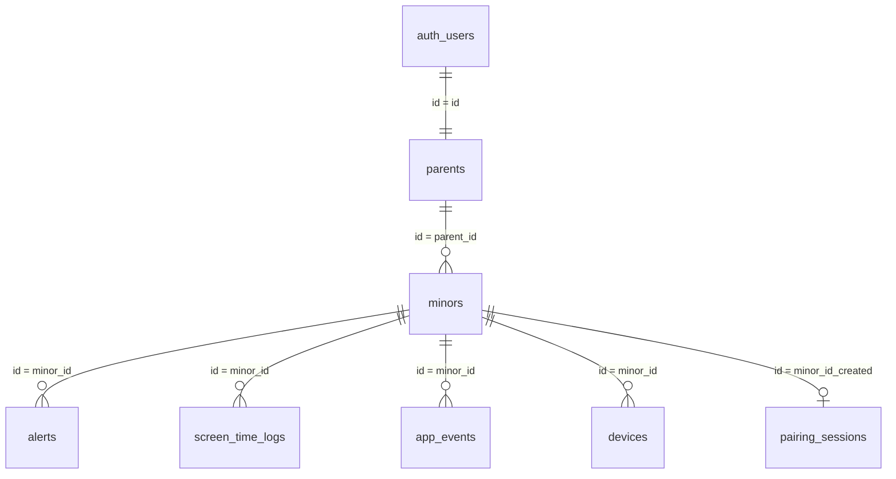

# Esquema de Base de Datos — Kipi Safe (Supabase)

Documentación del estado actual de las tablas en la instancia de Supabase del proyecto.

---

## Diagrama de Relaciones

---

## `parents`

Perfil del padre/madre. Su `id` es el mismo UUID de `auth.users` (FK implícita).

| Columna | Tipo | Restricciones |
|---|---|---|
| `id` | `uuid` | **Primary Key** |
| `email` | `text` | |
| `created_at` | `timestamptz` | Nullable |
| `safe_days_streak` | `int4` | Racha de días seguros (gamificación) |
| `completed_missions` | `jsonb` | Array de IDs de misiones completadas |

---

## `minors`

Perfil de un menor vinculado a un padre.

| Columna | Tipo | Restricciones |
|---|---|---|
| `id` | `uuid` | **Primary Key** |
| `parent_id` | `uuid` | FK → `parents.id` |
| `name` | `text` | |
| `age_mode` | `varchar` | Nullable (`child` / `teen`) |
| `shared_alert_levels` | `_int4` | Nullable. Array de niveles compartidos (ej. `{1,2,3}`) |
| `device_token` | `text` | Nullable. Token FCM del dispositivo |
| `created_at` | `timestamptz` | Nullable |

---

## `alerts`

Alertas generadas por IA o manualmente por el padre.

| Columna | Tipo | Restricciones |
|---|---|---|
| `id` | `uuid` | **Primary Key** |
| `minor_id` | `uuid` | FK → `minors.id` |
| `app_source` | `text` | App que originó la alerta |
| `risk_level` | `int4` | Nullable. 1 = info, 2 = medio, 3 = alto |
| `confidence_score` | `numeric` | Nullable. Confianza del análisis (0–1) |
| `sensitive_data_flag` | `bool` | Nullable. ¿Datos sensibles detectados? |
| `escalated_to_parent` | `bool` | Nullable. ¿Se escaló al padre? |
| `is_manual_help` | `bool` | Nullable. ¿Fue creada manualmente? |
| `created_at` | `timestamptz` | Nullable |

---

## `screen_time_logs`

Registro diario de tiempo de pantalla por app y menor.

| Columna | Tipo | Restricciones |
|---|---|---|
| `id` | `uuid` | **Primary Key** |
| `minor_id` | `uuid` | FK → `minors.id` |
| `app_name` | `text` | |
| `category` | `text` | Juegos, Redes Sociales, Videos, Educación, Comunicación, Otros |
| `minutes` | `int4` | Minutos de uso en ese día |
| `log_date` | `date` | Día del registro |
| `created_at` | `timestamptz` | |

> **Unique constraint**: `(minor_id, app_name, log_date)` — un registro por app por día por menor.

---

## `app_events`

Historial de eventos de apps en dispositivos de menores.

| Columna | Tipo | Restricciones |
|---|---|---|
| `id` | `uuid` | **Primary Key** |
| `minor_id` | `uuid` | FK → `minors.id` |
| `app_name` | `text` | |
| `event_type` | `text` | `installed` / `updated` / `uninstalled` |
| `category` | `text` | Categoría de la app |
| `risk_level` | `text` | `low` / `medium` / `high` |
| `created_at` | `timestamptz` | |

---

## `devices`

Dispositivos vinculados a menores.

| Columna | Tipo | Restricciones |
|---|---|---|
| `id` | `uuid` | **Primary Key** |
| `minor_id` | `uuid` | FK → `minors.id` |
| `device_name` | `text` | Nombre visible (ej. "iPhone de Mateo") |
| `device_model` | `text` | Nullable. Modelo del hardware |
| `os` | `text` | Nullable. Sistema operativo |
| `status` | `text` | `online` / `offline` |
| `battery` | `int4` | Nullable. Nivel de batería (0–100) |
| `last_sync` | `timestamptz` | Nullable. Última sincronización |
| `device_type` | `text` | `phone` / `tablet` |
| `protection_active` | `bool` | ¿Protección Kipi activa? |
| `created_at` | `timestamptz` | |

---

## `pairing_sessions`

Sesiones OTP para emparejar un dispositivo con la cuenta del padre/madre.

| Columna | Tipo | Restricciones |
|---|---|---|
| `id` | `uuid` | **Primary Key** |
| `otp` | `text` | **Unique**. Código de 6 caracteres |
| `status` | `text` | `pending` / `paired` |
| `expires_at` | `timestamptz` | Momento de expiración (15 min) |
| `device_model` | `text` | Nullable |
| `fcm_push_token` | `text` | Nullable |
| `minor_id_created` | `uuid` | Nullable. FK → `minors.id` (se llena al confirmar) |
| `created_at` | `timestamptz` | |
